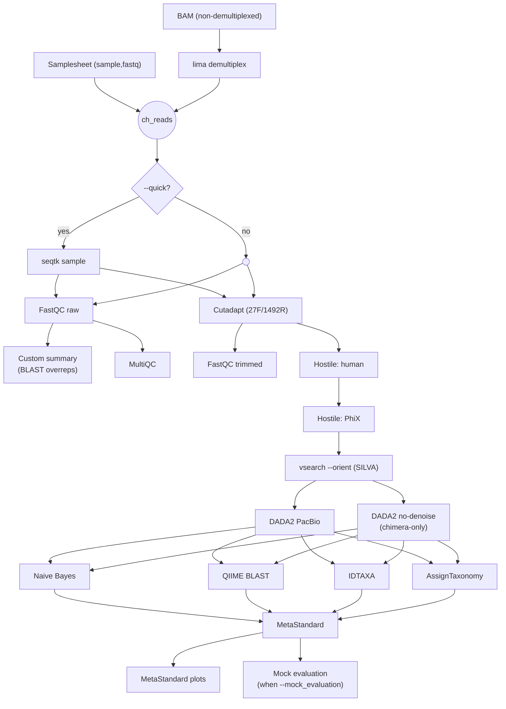

# Whole 16S rRNA amplicon workflow (PacBio HiFi)

## Table of Contents
- 🧬 [Overview](#overview)
- 🚀 [Quick Usage](#quick-usage)
- 📦 [Requirements](#requirements)
- 🛠️ [Installation](#installation)
- ⚙️ [Configuration](#configuration)
- 🔬 [Pipeline description](#pipeline-description)
- 📥 [Inputs](#inputs)
- 📤 [Outputs](#outputs)
- 🧪 [Mock community evaluation](#mock-community-evaluation)
- 📚 [References](#references)

## 🧬 Overview

This Nextflow pipeline performs taxonomic profiling of **long-read PacBio HiFi 16S rRNA** amplicon data covering the full 27F–1492R region. It integrates quality control, primer & adapter trimming, host & PhiX removal, orientation correction, ASV inference and taxonomic assignment using multiple complementary classifiers, plus optional mock-community evaluation.

All defaults are tuned for full-length HiFi data from our lab. Before any usage, please check that they fit your data as well.

The pipeline is a port of the sibling paired-end Illumina workflow
([16S-rRNA-amplicon-workflow](https://github.com/xpolak37/16S-rRNA-amplicon-workflow))
adapted for single-end PacBio CCS reads: paired-end merging, UNOISE3 and
Deblur are dropped (they break down on long reads); a `vsearch --orient`
step and an optional `lima` demultiplexing step are added.



## 🚀 Quick Usage

Prerequisites can be downloaded using:

```bash
bash setup_pipeline.sh
```

Whole workflow can be executed in two input modes.

**Mode 1 — already demultiplexed (samplesheet)**:

```bash
nextflow run main.nf \
    --input <path/to/samplesheet.csv> \
    --outdir <path/to/result_dir>
```

**Mode 2 — non-demultiplexed PacBio HiFi BAM**:

```bash
nextflow run main.nf \
    --bam <path/to/hifi.bam> \
    --barcodes <path/to/barcodes.fasta> \
    --outdir <path/to/result_dir>
```

`lima` will demultiplex into per-sample fastqs, and the rest of the pipeline runs identically to Mode 1.

**Test the pipeline**

After running `setup_pipeline.sh`, a tiny test dataset lives in `test/`. You can smoke-test the full workflow with:

```bash
nextflow run main.nf --input test/samplesheet.csv --outdir results --all --quick
```

`--all` runs every denoiser × classifier combination; `--quick` subsamples reads first so the whole run finishes in minutes.

**Quick mode (subsampling)**

To rapidly iterate on parameters, use `--quick` to subsample reads before everything else (default: 1000 reads per sample):

```bash
nextflow run main.nf --input samplesheet.csv --outdir results_quick --quick
```

Adjust the subsampling depth with `--quick_depth`:

```bash
nextflow run main.nf --input samplesheet.csv --outdir results_quick --quick --quick_depth 5000
```

## 📦 Requirements

The pipeline uses Nextflow ≥22.10.0 and Singularity, both assumed to be pre-installed. You will need at least 8 GB of RAM, 16 CPUs, ~5 GB of storage for classifier and Singularity image downloads, plus additional storage for run outputs (varies with sample count).

## 🛠️ Installation

The easiest way to get Nextflow and Singularity is to set up a dedicated Conda environment:

```bash
conda create --prefix </path/to/your/new/nf-env/> bioconda::nextflow
conda activate </path/to/your/new/nf-env/>
conda install conda-forge::singularity
```

Then clone the pipeline and run the setup script. It will interactively ask for an installation directory, where it creates `classifiers/` (reference databases), `singularity_cache/` (container images), `hostile_index/` (human T2T+HLA index), `phix/` (PhiX174 FASTA), `silva_orient/` (primer-anchored SILVA reference), `blast_db/` (optional 16S BLAST DB), `logs/`, and `tmp/` (Singularity SIF-extraction scratch):

```bash
git clone https://github.com/xpolak37/Whole-16S-rRNA-amplicon-workflow.git
cd Whole-16S-rRNA-amplicon-workflow
bash setup_pipeline.sh
```

The reference-data parameters are declared in `nextflow.config` as `null` sentinels — they have to be set before any run that exercises the corresponding stage. You can either edit `nextflow.config` directly or pass them on the command line.

| Param | What it is |
|---|---|
| `singularity_cache_dir` | Singularity image cache (defaults to `./singularity_cache`; rarely needs changing) |
| `classifiers_dir` | Directory containing all four classifier artefacts (see below) |
| `hostile_index_dir` | Directory containing the hostile human index files (`human-t2t-hla-argos985-mycob140.fa.gz` and `.mmi`) |
| `phix_fasta` | PhiX174 FASTA used for the second hostile pass |
| `silva_orient_db` | Primer-anchored SILVA reference for `vsearch --orient` |
| `blast_db_dir` | Local 16S BLAST DB dir (only needed if `--custom_summary_blast` is on) |

**Option A — edit `nextflow.config`** (replace each `null` with your path):

```groovy
params {
    classifiers_dir   = '/path/to/install/classifiers'
    hostile_index_dir = '/path/to/install/hostile_index'
    phix_fasta        = '/path/to/install/phix/phiX174.fasta'
    silva_orient_db   = '/path/to/install/silva_orient/silva-27F-1492R-orient.fasta'
    blast_db_dir      = '/path/to/install/blast_db'
}
```

**Option B — pass on the command line** (overrides whatever's in the config):

```bash
nextflow run main.nf \
    --input samplesheet.csv \
    --outdir results \
    --classifiers_dir   /path/to/install/classifiers \
    --hostile_index_dir /path/to/install/hostile_index \
    --phix_fasta        /path/to/install/phix/phiX174.fasta \
    --silva_orient_db   /path/to/install/silva_orient/silva-27F-1492R-orient.fasta \
    --blast_db_dir      /path/to/install/blast_db
```

`classifiers_dir` must contain the four classifier artefacts:
`qnb_classifier.qza`, `qblast_seqs.qza`, `qblast_tax.qza`, `idtaxa.RData`,
and `silva_assigntaxonomy.fa.gz`. Build them from a SILVA release using
`bin/extract_silva.sh` followed by `bin/train_classifiers.py` (the primer
arguments default to 27F / 1492R for full-length 16S).

**You are now ready to go!**

## ⚙️ Configuration

All pipeline parameters are defined in `nextflow.config`. You can either edit that file directly inside the `params { ... }` block, or override any parameter on the command line:

```bash
nextflow run main.nf \
    --input samplesheet.csv \
    --outdir results \
    --tax_level genus \
    --mock_evaluation
```

Command-line parameters always override values defined in `nextflow.config`.

**Tool axis** (`nextflow.config`):

```groovy
params {
    denoiser    = 'dada2'                              // dada2 | dada2_nodenoise (CSV for both)
    classifiers = 'qnb,qblast,idtaxa,assigntaxonomy'   // any subset CSV
    all         = false                                 // shortcut: run every denoiser × classifier
}
```

**Primers — full-length 16S (do not change for HiFi)**:

```groovy
params {
    f_primer = 'AGRGTTYGATYMTGGCTCAG'   // 27F
    r_primer = 'RGYTACCTTGTTACGACTT'    // 1492R
}
```

**DADA2 (PacBio-tuned — do not change)**:

```groovy
params {
    minQ         = 0
    minLen       = 1000
    maxLen       = 1600
    maxN         = 0
    maxEE        = 'Inf'
    minAbundance = 0.001  // used by --denoiser dada2_nodenoise
}
```

`dada2_nodenoise` skips `learnErrors`/`dada` entirely, dereplicates only and drops ASVs below `minAbundance`. Chimera removal is always applied.

**MetaStandard parameters**:

```groovy
params {
    run_id              = 'run01'   // baked into output filenames
    tax_level           = 'asv'     // domain | phylum | class | order | family | genus | species | asv
    metastandard_top_n  = 10        // top-N taxa in stacked barplot
}
```

**Mock community evaluation**:

```groovy
params {
    mock_evaluation = false
    mock_pattern    = 'Mock\\d+'
    mock_top_n      = 15
    mock_abundance  = "${projectDir}/composition/mock_asv_abundance.csv"
    mock_taxa       = "${projectDir}/composition/mock_taxa.csv"
    mock_synonyms   = "${projectDir}/composition/genus_synonyms.csv"
}
```

**Custom summary**:

```groovy
params {
    custom_summary               = true
    custom_summary_blast         = true
    custom_summary_blast_db      = '16S_ribosomal_RNA'
    custom_summary_top_overreps  = 10
    min_reads_threshold          = 10000
}
```

**Quick mode**:

```groovy
params {
    quick       = false
    quick_depth = 1000
}
```

---

## 🔬 Pipeline description

The pipeline is a modular Nextflow DSL2 workflow with one process per logical step. All processes ship as Singularity biocontainers — no local conda environments required.

### Workflow overview

1. **Input ingestion**
   Either a samplesheet (`sample,fastq` CSV) or a non-demultiplexed PacBio HiFi BAM. In BAM mode, **lima** demultiplexes into per-sample fastqs against the supplied barcode FASTA before anything else runs.

2. **Subsampling (optional)**
   When `--quick` is set, **seqtk sample** subsamples each sample to `--quick_depth` reads (default 1000) before FastQC. This is for fast parameter iteration; turn it off for real runs.

3. **Quality control**
   **FastQC** runs on raw and trimmed reads; **MultiQC** aggregates the results. A custom per-run summary HTML is also produced from the raw FastQC zips, optionally **BLAST**ing the most overrepresented sequences against a local 16S BLAST database to flag contamination.

4. **Adapter and primer trimming**
   **Cutadapt** removes the 27F primer at the 5′ end and the 1492R primer at the 3′ end, plus poly-A and poly-G tails, with `--revcomp` so reads in either orientation are handled.

5. **Host and contaminant removal**
   **Hostile** removes human reads (`human-t2t-hla-argos985-mycob140` masked T2T-CHM13v2.0 + IPD-IMGT/HLA index), then a second pass strips PhiX174.

6. **Orientation correction**
   **vsearch --orient** flips reads to a consistent orientation against a primer-anchored SILVA reference. PacBio CCS produces mixed-orientation reads, so this step is required (unlike paired-end Illumina).

7. **ASV inference**
   - **DADA2 PacBio** — full denoising with `errorEstimationFunction = makeBinnedQualErrfun` (per the upstream PacBio recommendation in [dada2#2107](https://github.com/benjjneb/dada2/issues/2107)).
   - **DADA2 no-denoise** (`--denoiser dada2_nodenoise`) — dereplicate only, drop ASVs below `minAbundance`, then chimera removal. Useful when the error model is unstable on small libraries.

8. **Taxonomic assignment**
   Each ASV table can be classified with any subset of:
   - **QIIME Naive Bayes** (`qnb`)
   - **QIIME consensus-BLAST** (`qblast`)
   - **DECIPHER IDTAXA** (`idtaxa`)
   - **DADA2 assignTaxonomy** (`assigntaxonomy`)

   Use `--classifiers` to pick a subset, or `--all` to run every denoiser × classifier combination.

9. **MetaStandard unification**
   For every (denoiser × classifier) pair, **MetaStandard16S** merges ASV counts and taxonomy into a single relative-abundance table aggregated to `--tax_level` (default `asv`, which keeps each ASV as its own row with `TaxID = full_taxonomy|sequence`). **MetaStandard plots** then produces a stacked bar chart (top-N taxa + Other) and a clustered heatmap per output table.

10. **Mock community evaluation (optional)**
    When `--mock_evaluation` is set, samples whose IDs match `--mock_pattern` are scored against the bundled reference composition (Bray-Curtis dissimilarity, Pearson correlation, RMSE) and a side-by-side reference-vs-observed barplot is rendered for every (denoiser × classifier) pair.

11. **Read-count ledger**
    A `pipeline_info/read_counts_summary.tsv` ledger is collated across stages so you can see how many reads survive each step per sample.

### Key features

- **Single-end PacBio HiFi only** — no paired-end logic, no merging step. Mixed-orientation reads handled via `vsearch --orient`.
- **Two denoising modes** — full DADA2 with binned quality error functions, or a chimera-only fast-path for shallow libraries.
- **Four classifiers, one Cartesian** — pick any subset, or `--all` for every combination; outputs are organised under `taxonomy/<denoiser>/<classifier>/`.
- **Reproducible containers** — every process runs in a per-tool Singularity biocontainer; no host conda environments.
- **MetaStandard cross-run TSVs** — `<denoiser>_<classifier>_<run_id>_<level>.tsv` filenames make it trivial to compare runs in downstream analysis.
- **Optional `lima` demultiplexing** — feed a raw HiFi BAM + barcodes and the pipeline demultiplexes for you.
- **`--quick` smoke mode** — subsample first, end-to-end run in minutes for parameter tuning.

## 📥 Inputs

The pipeline accepts two input modes; pass exactly one of `--input` or `--bam`.

**Mode 1 — samplesheet (`--input`)**

A CSV with the following columns:

| Column | Description |
|--------|-------------|
| `sample` | Unique sample identifier (no whitespace) |
| `fastq`  | Absolute or relative path to the per-sample reads file. Accepts `.fastq[.gz]`, `.fq[.gz]` or per-sample PacBio HiFi `.bam`. BAMs are auto-converted to fastq via `pbtk bam2fastq` (and indexed with `pbindex` if needed). The two formats can be mixed in a single samplesheet. |

Example `samplesheet.csv` mixing both formats:

```csv
sample,fastq
sample1,/path/to/sample1.fastq.gz
sample2,/path/to/sample2.fastq.gz
bc21,/path/to/bc21.bam
bc22,/path/to/bc22.bam
```

**Mode 2 — non-demultiplexed BAM (`--bam` + `--barcodes`)**

| Flag | Description |
|------|-------------|
| `--bam`              | PacBio HiFi BAM (one library, multiple samples)         |
| `--barcodes`         | Barcode FASTA fed to `lima --peek-guess`                |
| `--lima_extra_args`  | Extra args appended to the `lima` command (optional)    |

`lima` writes per-sample fastqs into `results/lima/`; downstream stages pick them up automatically.

## 📤 Outputs

The pipeline generates the following directory structure under `--outdir`:

```
results
├── lima/                       # only in --bam mode
├── bam2fastq/                  # only when samplesheet contains .bam paths
├── subsampled/                 # only in --quick mode
├── fastqc_raw/
├── fastqc_trimmed/
├── cutadapt/
├── hostile/
├── orient/                     # vsearch --orient outputs
├── dada2/
│   ├── dada2/                  # full DADA2
│   │   ├── ASV_table.tsv
│   │   ├── ASV_sequences.fasta
│   │   └── track_control.tsv
│   └── dada2_nodenoise/        # chimera-only path
│       └── ...
├── taxonomy/
│   └── <denoiser>/             # dada2 | dada2_nodenoise
│       ├── qnb/taxa_table_qnb.tsv
│       ├── qblast/taxa_table_qblast.tsv
│       ├── idtaxa/taxa_table_idtaxa{,_conf}.tsv
│       └── assigntaxonomy/taxa_table_assigntaxonomy.tsv
├── metastandard/
│   └── <denoiser>/<classifier>/
│       ├── <denoiser>_<classifier>_<run_id>_<level>.tsv
│       ├── ..._barplot.png
│       └── ..._heatmap.png
├── mock_evaluation/            # only when --mock_evaluation
│   └── <denoiser>/<classifier>/
│       ├── <denoiser>_<classifier>_mock_barplot.png
│       ├── ..._metrics.tsv
│       └── ..._composition.tsv
├── multiqc/
├── custom_summary/
│   ├── custom_summary.html
│   ├── parsed.json
│   ├── top_seqs.fasta
│   └── blast_hits.tsv
└── pipeline_info/
    └── read_counts_summary.tsv # per-stage read-count ledger
```

**Output descriptions**

| Directory | Contents | Description |
|-----------|----------|-------------|
| `lima/` | Per-sample FASTQ + lima report | Demultiplexing of raw HiFi BAM (Mode 2 only) |
| `bam2fastq/` | Per-sample FASTQ | `pbtk bam2fastq` conversion of per-sample BAMs supplied via the samplesheet |
| `subsampled/` | Subsampled FASTQ per sample | Reads downsampled to `--quick_depth` (only when `--quick`) |
| `fastqc_raw/` / `fastqc_trimmed/` | FastQC HTML & ZIP | Quality metrics before and after Cutadapt |
| `cutadapt/` | Trimmed FASTQ | Reads after primer + adapter removal |
| `hostile/` | Decontaminated FASTQ | Reads after human + PhiX removal (two-pass hostile) |
| `orient/` | Oriented FASTQ | Reads flipped to a consistent strand against SILVA |
| `dada2/<denoiser>/` | ASV tables + sequences + track | DADA2 (full or no-denoise) inference outputs |
| `taxonomy/<denoiser>/<classifier>/` | Taxa tables | One folder per (denoiser × classifier) combination |
| `metastandard/<denoiser>/<classifier>/` | Unified TSV + barplot + heatmap | Standardised cross-run table per combination |
| `mock_evaluation/<denoiser>/<classifier>/` | Reference-vs-observed barplot, metrics, composition | Per-combination mock community evaluation |
| `multiqc/` | MultiQC HTML + JSON | Aggregated FastQC across raw and trimmed reads |
| `custom_summary/` | HTML report + parsed JSON + top sequences FASTA + BLAST hits TSV | Per-run quality summary with optional BLAST of overrepresented sequences |
| `pipeline_info/` | `read_counts_summary.tsv` ledger | Per-stage surviving read counts per sample |

---

## 🧪 Mock community evaluation

The pipeline can automatically evaluate mock community samples against a known reference composition for every (denoiser × classifier) combination. This catches regressions in DADA2 parameters or classifier behaviour before they affect downstream interpretation.

### How it works

1. **Identifies mock samples** in each MetaStandard table using `--mock_pattern` (default: `Mock\d+`, case-insensitive).
2. **Extracts genus-level abundances** from the MetaStandard `TaxID` column.
3. **Aggregates the reference** in `composition/mock_asv_abundance.csv` + `composition/mock_taxa.csv` to genus level, normalising names via `composition/genus_synonyms.csv`.
4. **Compares** observed vs reference per sample and emits:
   - Stacked barplot (reference vs each mock sample)
   - Metrics: Bray-Curtis dissimilarity, Pearson correlation + p-value, RMSE
   - Full composition table

### Configuration

Mock evaluation is **off by default**. Enable per-run with `--mock_evaluation`, or switch the default in `nextflow.config`:

```groovy
params {
    mock_evaluation = true
    mock_pattern    = 'Mock\\d+'
    mock_top_n      = 15
    mock_abundance  = "${projectDir}/composition/mock_asv_abundance.csv"
    mock_taxa       = "${projectDir}/composition/mock_taxa.csv"
    mock_synonyms   = "${projectDir}/composition/genus_synonyms.csv"
}
```

### Reference files

The bundled `composition/` directory contains a starting reference set ported from the sibling Illumina pipeline. Replace these with your own PacBio mock community files when needed:

**`mock_asv_abundance.csv`** — expected per-ASV abundance:

```csv
ASV,Mock Reference
ASV1,0.042
ASV2,0.101
...
```

**`mock_taxa.csv`** — taxonomy per ASV:

```csv
ASV,Domain,Phylum,Class,Order,Family,Genus,Species
ASV1,Bacteria,Proteobacteria,Gammaproteobacteria,Pseudomonadales,Pseudomonadaceae,Pseudomonas,Pseudomonas aeruginosa
...
```

**`genus_synonyms.csv`** — alias → canonical mapping for genus normalisation:

```csv
name,canonical_name
Lactobacillus,Limosilactobacillus
Ligilactobacillus,Limosilactobacillus
```

### Output files

For each (denoiser × classifier) combination:

- `<denoiser>_<classifier>_mock_barplot.png` — reference vs observed barplot
- `<denoiser>_<classifier>_mock_metrics.tsv` — Bray-Curtis / Pearson / RMSE
- `<denoiser>_<classifier>_mock_composition.tsv` — full composition table

Outputs are emitted only when at least one sample matches `--mock_pattern`; runs without mock samples produce nothing and are not flagged as failures.

---

## 📚 References

If you use this pipeline, please cite:

- **Nextflow:** Di Tommaso, P., et al. (2017). Nextflow enables reproducible computational workflows. *Nature Biotechnology*, 35(4), 316–319.
- **lima:** Pacific Biosciences. lima — the PacBio barcode demultiplexer. https://github.com/PacificBiosciences/barcoding
- **FastQC:** Andrews, S. (2010). FastQC: A Quality Control Tool for High Throughput Sequence Data.
- **MultiQC:** Ewels, P., et al. (2016). MultiQC: summarize analysis results for multiple tools and samples in a single report. *Bioinformatics*, 32(19), 3047–3048.
- **Cutadapt:** Martin, M. (2011). Cutadapt removes adapter sequences from high-throughput sequencing reads. *EMBnet.journal*, 17(1), 10–12.
- **Hostile:** Constantinides, B., et al. (2023). Hostile: accurate decontamination of microbial host sequences. *Bioinformatics*, 39(12), btad728.
- **VSEARCH:** Rognes, T., et al. (2016). VSEARCH: a versatile open source tool for metagenomics. *PeerJ*, 4, e2584.
- **DADA2:** Callahan, B., et al. (2016). DADA2: High-resolution sample inference from Illumina amplicon data. *Nature Methods* 13, 581–583. PacBio adaptation: Callahan, B. J., et al. (2019). High-throughput amplicon sequencing of the full-length 16S rRNA gene with single-nucleotide resolution. *Nucleic Acids Research*, 47(18), e103.
- **QIIME2:** Bolyen, E., et al. (2019). Reproducible, interactive, scalable and extensible microbiome data science using QIIME 2. *Nature Biotechnology* 37, 852–857.
- **DECIPHER / IDTAXA:** Wright, E. S. (2024). Fast and Flexible Search for Homologous Biological Sequences with DECIPHER v3. *The R Journal*, 16(2), 191–200.
- **SILVA:** Quast, C., et al. (2013). The SILVA ribosomal RNA gene database project: improved data processing and web-based tools. *Nucleic Acids Research*, 41(D1), D590–D596.
